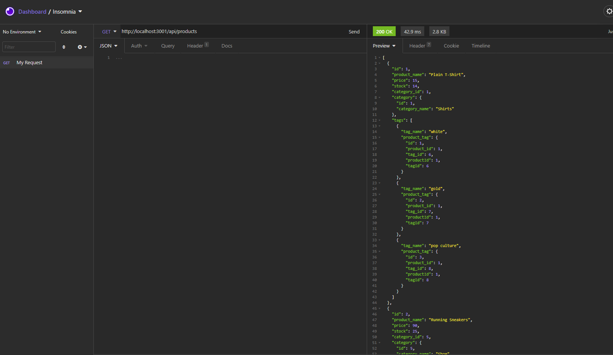

# Object-Relational Mapping: E-Commerce Backend

### Table of Contents

- [Description](#description)
- [Installation](#installation)
- [Usage](#usage)
- [Contribution](#contribution)
- [License](#license)

## Description

This project creates back end for e-commerce website.

User Story:

- GIVEN a functional Express.js API
- WHEN I add my database name, MySQL username, and MySQL password to an environment variable file
- THEN I am able to connect to a database using Sequelize
- WHEN I enter schema and seed commands
- THEN a development database is created and is seeded with test data
- WHEN I enter the command to invoke the application
- THEN my server is started and the Sequelize models are synced to the MySQL database
- WHEN I open API GET routes in Insomnia Core for categories, products, or tags
- THEN the data for each of these routes is displayed in a formatted JSON
- WHEN I test API POST, PUT, and DELETE routes in Insomnia Core
- THEN I am able to successfully create, update, and delete data in my database

## Mock up

## Installation

Both Node.js and MySQL must be installed on your computer.

- Install dependencies
  npm install

-Open up MySQL shell and input
source db/schema.sql
and

use ecommerce_db
Then quit MySQL shell and input the following in your terminal

-npm run seed
to start running application simply input

-node server.js
Open up Insomnia core to GET, POST, PUT and DELETE from different routes.

## Usage

For instruction on how to use this project, please refer to walk-through video.

## Contribution

Please feel free in making contribution to this repository. But please first discuss the change via email with me. I will try to get back to you as soon as possible.

## Questions

If you have any questions feel free to contact me:

Github Username: sona29

Email: sona.shrestha004@gmail.com

## License

## Walk-through Video

##### Video: [TeamProfile Generator Walk-through](https://drive.google.com/file/d/1xpg35eNshSvpFfMv1DTstRLhJj6fJBHl/view)
